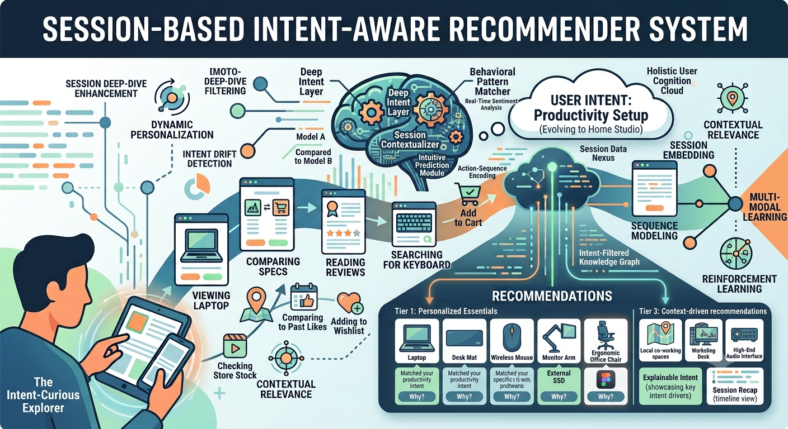

<!DOCTYPE html>
<html>
<head>

</head>
<body>
<h2>Intent Aware Recommender Systems</h2>

  
  

<h3>Introduction</h3>

This reproducibility package was prepared for the paper titled "Performance Comparison of Intent Aware and Non-Intent Aware Recommender Systems" and submitted to the ABC.  The results reported in this paper were achieved with the help of the codes, which were shared by the original authors of the selected articles. For the implementation of baseline models, we utilized the session-rec and RecSys2019_DeepLearning_Evaluation  frameworks. These frameworks include the state-of-the-art baseline models for session based and top-n recommender systems. More information about the session-rec and RecSys2019_DeepLearning_Evaluation frameworks can be found by following the given links. 

<ul>
  <li><a href="https://rn5l.github.io/session-rec/index.html" target="_blank">Session rec framework</a></li>
  <li><a href="https://github.com/MaurizioFD/RecSys2019_DeepLearning_Evaluation.git" target="_blank"> RecSys2019_DeepLearning_Evaluation  framework </a></li>
</ul>
<h5>Selected articles</h5>

<ul>
<li>Modeling Multi-Purpose Sessions for Next-Item Recommendations via Mixture-Channel Purpose Routing Networks (JCAI'19)</li> 
<li>Enhancing Hypergraph Neural Networks with Intent Disentanglement for Session-based Recommendation (SIGIR'2022)</li>
<li>Dynamic Intent Aware Iterative Denoising Network for Session-based Recommendation (Journal: Information Processing & Management'2022 - IF: 7.4)</li> 
<li>Efficiently Leveraging Multi-level User Intent for Session-based Recommendation via Atten-Mixer Network (WSDM'23)</li> 
</ul>

<h5>Required libraries to run the framework</h5>
<ul>
  <li>Anaconda 4.X (Python 3.8 or higher)</li>
  <li>numpy</li>
  <li>pandas</li>
  <li>torch</li>
  <li>torchvision</li>
  <li>torch_geometric</li>
  <li>pyg_lib</li>
  <li>torch-scatter</li>
  <li>torch-sparse</li>
  <li>torch-cluster</li>
  <li>torch-spline-conv</li>
  <li>prettytable</li>
  <li>python-dateutil</li>
  <li>nltk</li>
  <li>scipy</li>
  <li>pytz</li>
  <li>certifi</li>
  <li>pyyaml</li>
  <li>scikit-learn</li>
  <li>six</li>
  <li>psutil</li>
  <li>pympler</li>
  <li>Scikit-optimize</li>
  <li>tables</li>
  <li>scikit-optimize</li>
  <li>tqdm</li>
  <li>dill</li>
  <li>numba</li>
</ul>
<h2>Installation guide</h2>  

This is how the framework can be downloaded and configured to run the experiments

<h5>Using Docker</h5>
<ul>
  <li>Download and install Docker from <a href="https://www.docker.com/">https://www.docker.com/</a></li>
  <li>Run the following command to "pull Docker Image" from Docker Hub: <code>docker pull shefai/intent_aware_recomm_systems</code>
  <li>Clone the GitHub repository by using the link: <code>https://github.com/Faisalse/IntentAwareRS.git</code>
  <li>Move into the <b>IntentAwareRS</b> directory</li>
  
  <li>Run the command to mount the current directory <i>IntentAwareRS</i> to the docker container named as <i>IntentAwareRS_container</i>: <code>docker run --name IntentAwareRS_container  -it -v "$(pwd):/IntentAwareRS" -it shefai/IntentAwareRS</code>. If you have the support of CUDA-capable GPUs then run the following command to attach GPUs with the container: <code>docker run --name IntentAwareRS_container  -it --gpus all -v "$(pwd):/IntentAwareRS" -it shefai/IntentAwareRS</code></li> 
<li>If you are already inside the runing container, run the command to navigate to the mounted directory <i>IntentAwareRS</i>: <code>cd /IntentAwareRS</code> otherwise starts the "IntentAwareRS_container"</li>
</ul>  
<h5>Using Anaconda</h5>
  <ul>
    <li>Download Anaconda from <a href="https://www.anaconda.com/">https://www.anaconda.com/</a> and install it</li>
    <li>Clone the GitHub repository by using this link: <code>https://github.com/Faisalse/IntentAwareRS.git</code></li>
    <li>Open the Anaconda command prompt</li>
    <li>Move into the <b>IntentAwareRS</b> directory</li>
    <li>Run this command to create virtual environment: <code>conda create --name IntentAwareRS_env python=3.8</code></li>
    <li>Run this command to activate the virtual environment: <code>conda activate IntentAwareRS_env</code></li>
    <li>Run this command to install the required libraries for CPU: <code>pip install -r requirements_cpu.txt</code>. However, if you have support of CUDA-capable GPUs, 
        then run this command to install the required libraries to run the experiments on GPU: <code>pip install -r requirements_gpu.txt</code></li>
  </ul>

<h2>Instructions to Run Experiments for Intent Aware and Non-intent Aware Recommender Systems</h2>

<h5>Dynamic Intent-aware Iterative Denoising Network for Session-based Recommendation (DIDN)</h5>
<ul>
<li>Download <a href="https://drive.google.com/drive/folders/1GocLZfbuwtxUjdRVEKq9xONyDbOjoNm4?usp=sharing" target="_blank">Yoochoose</a> dataset, unzip it and put the "yoochoose-clicks.dat" file into the "data" directory/folder </li>
<li>Run this command to reproduce the experiments for the DIDN and baseline models on the shorter version of the Yoochoose dataset: <code>python run_experiments_for_DIDN_baseline_models.py --dataset yoochoose1_64</code> and run the following command to create the experiments for the larger version of the Yoochoose dataset <code>python run_experiments_for_DIDN_baseline_models.py --dataset yoochoose1_4</code>  </li>
<li>Download <a href="https://drive.google.com/drive/folders/1GocLZfbuwtxUjdRVEKq9xONyDbOjoNm4?usp=sharing" target="_blank">Diginetica</a> dataset, unzip it and put the "train-item-views.csv" file into the "data" directory/folder </li>
<li>Run this command to reproduce the experiments for the DIDN and baseline models on the Diginetica dataset: <code>python run_experiments_for_DIDN_baseline_models.py --dataset diginetica</code></li> 
</ul>

<h5>Enhancing Hypergraph Neural Networks with Intent Disentanglement for Session-based Recommendation (HIDE)</h5>
<ul>
<li>Download <a href="https://drive.google.com/drive/folders/1GocLZfbuwtxUjdRVEKq9xONyDbOjoNm4?usp=sharing" target="_blank">Tmall</a> dataset, unzip it and put the "dataset15.csv" file into the "data" directory/folder </li>
<li>Run this command to reproduce the experiments for the HIDE and baseline models on the Tmall dataset: <code>python run_experiments_HIDE_baseline_models.py --dataset Tmall</code></li>
</ul>

<h5>Modeling Multi-Purpose Sessions for Next-Item Recommendations via Mixture-Channel Purpose Routing Networks (Atten-Mixer)</h5>
<ul>
<li>Download <a href="https://drive.google.com/drive/folders/1GocLZfbuwtxUjdRVEKq9xONyDbOjoNm4?usp=sharing" target="_blank">Diginetica</a> dataset, unzip it and put the "train-item-views.csv" file into the "data" directory/folder </li>
<li>Run this command to reproduce the experiments for the Atten-Mixer and baseline models on the Diginetica dataset: <code>python run_experiments_AttenMixer_baseline_models.py --dataset diginetica</code></li>

<li>Download <a href="https://drive.google.com/drive/folders/1GocLZfbuwtxUjdRVEKq9xONyDbOjoNm4?usp=sharing" target="_blank">Gowalla</a> dataset, unzip it and put the "loc-gowalla_totalCheckins.txt.gz" file into the "data" directory/folder </li>
<li>Run this command to reproduce the experiments for the Atten-Mixer and baseline models on the Gowalla dataset: <code>python run_experiments_AttenMixer_baseline_models.py --dataset gowalla</code></li>

<li>Download <a href="https://drive.google.com/drive/folders/1GocLZfbuwtxUjdRVEKq9xONyDbOjoNm4?usp=sharing" target="_blank">Yoochoose</a> dataset, unzip it and put the "yoochoose-clicks.dat" file into the "data" directory/folder </li>
<li>Run this command to reproduce the experiments for the Atten-Mixer and baseline models on the shorter version of the Yoochoose dataset: <code>python python run_experiments_AttenMixer_baseline_models.py --dataset yoochoose1_64</code> and run the following command to create the experiments for the larger version of the Yoochoose dataset <code>python python run_experiments_AttenMixer_baseline_models.py --dataset yoochoose1_4</code>  </li>

<li>Download <a href="https://drive.google.com/drive/folders/1GocLZfbuwtxUjdRVEKq9xONyDbOjoNm4?usp=sharing" target="_blank">Retailrocket</a> dataset, unzip it and put the "events.csv" file into the "data" directory/folder </li>
<li>Run this command to reproduce the experiments for the Atten-Mixer and baseline models on the Diginetica dataset: <code>python run_experiments_AttenMixer_baseline_models.py --dataset retailrocket</code></li>
</ul>

<h5>Efficiently Leveraging Multi-level User Intent for Session-based Recommendation via Atten-Mixer Network (MCPRN)</h5>
<ul>
<li>Download <a href="https://drive.google.com/drive/folders/1GocLZfbuwtxUjdRVEKq9xONyDbOjoNm4?usp=sharing" target="_blank">Yoochoose</a> dataset, unzip it and put the "yoochoose-buys.csv" file into the "data" directory/folder </li>
<li>Run this command to reproduce the experiments for the MCPRN and baseline models on the Yoochoose-buys dataset: <code>python run_experiments_for_MCRPN_baseline_models.py --dataset yoochoose</code></li>
</ul>

</body>
</html>  

